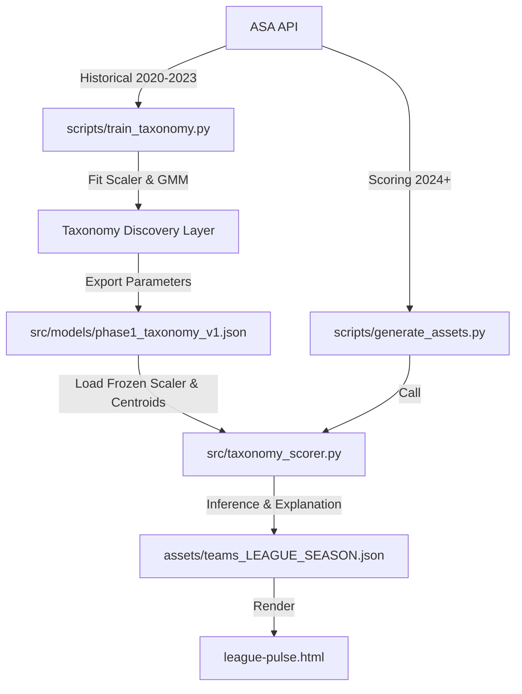

# Implementation Plan: Phase 1 Taxonomy Redesign

**Date:** 2026-05-19  
**Status:** Ready for execution  
**Target Version:** `phase1_taxonomy_v1`  
**Reference Cohort:** `2020-2023` (pooled MLS, USLC, NWSL, USL1)  
**Scoring Cohort:** `2024+`  

This plan outlines the file-level tasks required to transition the Tactical-Value Mapping System (TVMS) from exploratory season-by-season clustering to a frozen, reference-calibrated tactical taxonomy.

---

## 1. System Architecture



---

## 2. File-Level Task Breakdown

### Phase A: Model Training & Discovery

#### [Task A.1] Create `scripts/train_taxonomy.py`
Create a one-off script to download the reference cohort data, fit the normalizer and clustering model, and export the parameters.
* **Inputs:** Raw data for MLS, USLC, NWSL, and USL1 for seasons `2020`, `2021`, `2022`, `2023`.
* **Logic:**
  1. Concatenate all team-seasons into a single pooled DataFrame.
  2. Fit `StandardScaler` on `TACTICAL_FEATURES` and save its `mean_` and `scale_`.
  3. Fit a `GaussianMixture` model (range 5 to 7 components). Use BIC to determine the optimal count or manually select 6 clusters.
  4. Extract the cluster centroids (mean vectors in scaled space).
  5. Calculate the relative margin between the top 1st and 2nd scores for all teams in the reference cohort. Set the hybrid threshold $\theta$ to the 15th percentile of these margins (so 15% of the reference teams are flagged as hybrids).
  6. Export all parameters to `src/models/phase1_taxonomy_v1.json`.

#### [Task A.2] Create `src/models/phase1_taxonomy_v1.json`
Generate the JSON model parameters containing the scaler weights, cluster centroids, display names for each of the 6 tactical identities, and the hybrid threshold $\theta$.

---

### Phase B: Scoring & Inference

#### [Task B.1] Create `src/taxonomy_scorer.py`
Implement the inference logic that loads the frozen model and scores active seasons.
* **API:**
  ```python
  class TaxonomyScorer:
      def __init__(self, model_path: str = "src/models/phase1_taxonomy_v1.json"):
          # Loads JSON and initializes scaler and centroids
          pass
          
      def score_team(self, team_features: dict) -> dict:
          # 1. Scale input using frozen mean & scale
          # 2. Compute Cosine Similarity (or negative Euclidean distance) to each centroid
          # 3. Identify Primary and Secondary identities
          # 4. Check if (Primary - Secondary) / Primary < hybrid_threshold -> hybrid_flag = True
          # 5. Generate template-based explanation payload
          # 6. Return dict matching backward-compatible frontend schema
  ```

#### [Task B.2] Update `src/identity.py`
* Clean up or deprecate `name_clusters` and `build_team_identities` to avoid confusion.
* Retain helper methods like `describe_pca_axes` for visual charts, but point them to the new taxonomy definitions.

#### [Task B.3] Update `scripts/generate_assets.py`
* Modify `generate_combo` to instantiate the `TaxonomyScorer` instead of running `cluster_teams` dynamically on active seasons.
* Ensure output JSON formats are backward-compatible so that `identity`, `metric`, and `z_score` are still present as top-level fields for the frontend, but enrich them with `secondary_identity`, `hybrid_flag`, and `explanation`.

---

### Phase C: Validation & Tests

#### [Task C.1] Create `tests/test_taxonomy_scorer.py`
* Test that `TaxonomyScorer` successfully loads the JSON parameters.
* Test that inference on a mock team vector yields the correct primary identity.
* Test that a team lying between two centroids correctly triggers `hybrid_flag = True`.
* Test that the output dictionary matches the schema expected by the asset generator.

---

### Phase D: Web Frontend Integration

#### [Task D.1] Enhance `league-pulse.html`
* Update the team card rendering logic (lines 161–186) to display the new fields:
  * If `hybrid_flag` is true, display badges for both `identity` and `secondary_identity` (labeled as "Hybrid").
  * Replace the generic z-score text with the newly generated statistical `explanation`.
* Update the tactical map legend to reflect the new 5–7 stable identities rather than the legacy 15 identities.

#### [Task D.2] Clean up `all-identities.html` and `index.html`
* Update `all-identities.html` to catalog and describe the new stable 6 identities instead of the legacy 15.
* Update `index.html`'s "Schools of Thought" section to list the new identities.

---

## 3. Deployment & Integration Checklist

1. **Verify API availability:** Ensure NWSL and USL1 goals added ($g+$) metrics are fully populated on the ASA server for `2020-2023`.
2. **Compile the Taxonomy JSON:** Run `train_taxonomy.py` locally and verify the file is created.
3. **Run Suite Tests:** Run `pytest tests/` to confirm no regressions in preprocessing or loading.
4. **Re-generate all historical assets:** Run `python scripts/generate_assets.py` for all seasons (`2020` to `2026`) to overwrite legacy outputs with baseline-calibrated metrics.
5. **Verify UI layout:** Load `league-pulse.html` in a web browser to ensure card grid layouts accommodate the new explanation texts and hybrid badges.
6. **Push to master:** Commit changes to trigger the GitHub Pages deployment.
